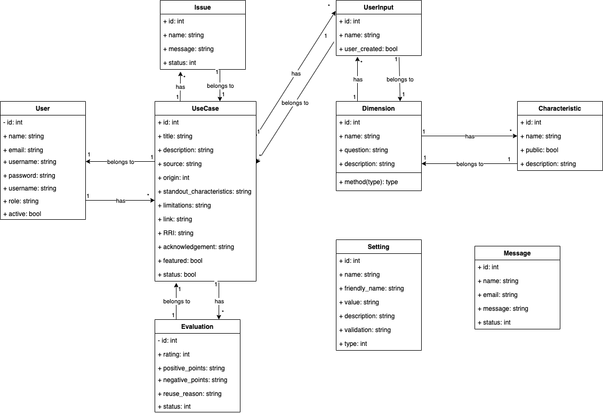

# TAS Usecase Library Documentation  

This web application has been developed at the [e-Research](https://www.kcl.ac.uk/research/facilities/e-research) department of King's College London.

### Introduction

TAS Usecase Library is a web application developed in PHP 8.1. It is developed on top of
[Laravel 10](https://laravel.com) equipped with [Jetstream](https://jetstream.laravel.com/introduction.html)
and [Livewire](https://livewire.laravel.com). For the user interface [TailWind CSS](https://tailwindcss.com/) has been used along with 
[AlpineJS](https://alpinejs.dev), and [jQuery](https://jquery.com).

The application uses [composer](https://getcomposer.org) for package management related to PHP and [npm](https://www.npmjs.com) for user interface dependencies.

The application is deployed using [Docker](http://docker.com). Two images are created, one for hosting the web application,
and the other for MySQL database. The containers communicate through a single network with a bridge driver.

### Prerequisites

Since this application is written in PHP 8, the reader has to have a good command over the language in order to extend the application.

To understand the architecture of the application and deploy it, it is necessary that the reader be 
familiar with the MVC (Model, View, Controller) architecture in the context of web applications.

Once some familiarity with MVC is achieved, the reader needs to learn about Laravel, Livewire, and TailWind CSS.

Familiarity with MySQL, or relational databases is essential for understanding the data model and entities which are stored in the system.

### Application Structure

#### Data Model

The data model defines entities whose data is stored on the system. These entities and the relationship among them
have been defined based on the requirements of the application.

* **Usecase**
  * Usecase is the central entity in the application. As the application name TAS Usecase Library suggests,
  the aim of the application is to collect usecases and share them with the public.
* **Dimension**  
  * Dimensions and characteristics form a taxonomy for categorising usecases.
* **Characteristic**  
  * As a children of dimensions, characteristics define usecases.
* **UserInput**
  * As a children of dimensions, user input records data that users provide when creating a usecase. 
* **Evaluation**  
  * An evaluation is a set of responses from registered users of the library that reflect the quality of usecases.
* **Issue**  
  * An issue is a message about usecases that reports a problem or a correction for the usecase. 
  Issues can be recorded by any visitor.
* **Message**  
  * A message is recorded through a contact us form and is accessible to all users.
* **User**
  * Registered users can log in to the library with credentials. There are various roles for users like Administrator, Contributor, and Content Manager.
* **Setting** 
  * Setting is used to store core application configuration data and some text blocks for the external pages.

The above entities have a corresponding table in the MySQL database. The table name is the name of the entity in lower case plural. 
For example for the _User_ entity the table name is _users_. The entities are represented as PHP classes in the code.
They inherit from Laravel Model class. 

Below is a UML diagram that shows the attributes of the above entities
and how they are related.

#### Views

Views are HTML-based templates that make up the user interface of the web application. They benefit from
Laravel Blade engine. Views are located in the **resources/views** directory. Views corresponding to data models are 
in the tas subdirectory. The following naming convention has been used in view file names for data model entities:

* create
* read
* update
* delete
* list

#### Directories
* Controllers
  * Controllers are located in `app/Http/Controllers`
* Views
  * Views are located in `resources/views`. More specifically, the `tas` subdirectory 
   contains views related to data model entities.
* Models
  * Models are located in `app/Models`

### Livewire Components

Throughout the application some forms have been placed into modal dialogue boxes.
Forms in the modals communicate to the backend through Livewire. 
A modal dialogue box is a window that shows up over the content of the main page.

Below is a list of the components that have been implemented using Livewire:
* **Registration**
* **Authentication (Login)**
* **Usecase Creatio**n
* **Contact Us**
* **Usecase Issues**
* **Usecase Evaluations**
* **Search**

Livewire components have two files: the class file and the view file. The class 
file is a standard PHP class extending the Livewire Component class and acts as 
the backend of the component. The view file, which contains user interface elements,
acts as the frontend of the component.

Below are the paths for the Livewire components:

1. `app/Http/Livewire` where the backend files are located
2. `resources/views/livewire` where the view files are located.

The files that are for the modal dialogue components have a _**modal**_ suffix in their name.

### Deployment

The web application can be deployed through **docker-compose**. There are two images and a container
will be created for each one:

Webserver Image : This image created through a Dockerfile from the standard PHP
image, and an Apache web server is created with necessary PHP components. 
Database Image : This image is created from a standard Docker MySQL image.

The docker-compose.yml file in the root directory creates two images and runs them. 

To deploy the application you need **Docker** and **docker-compose**. 

To create images, run the following command in the root directory of the application:

`docker-compose build`

Once the images are built, to start the containers:

`docker-compose up -d`

To stop the containers:

`docker-compose stop`

To connect to each container you need its name or ID. You can run the following command
to get the list of containers currently running:

`docker ps`

To connect to a container you can use the following command:

`docker exec -it container_name_or_ID /bin/bash`
